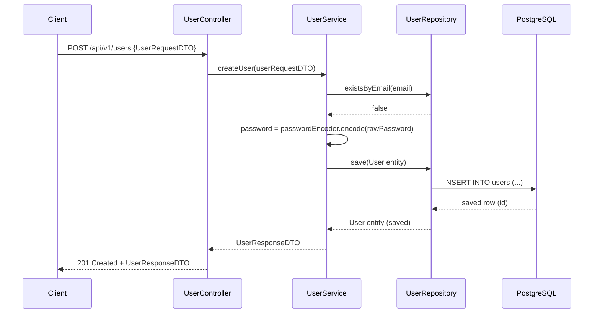
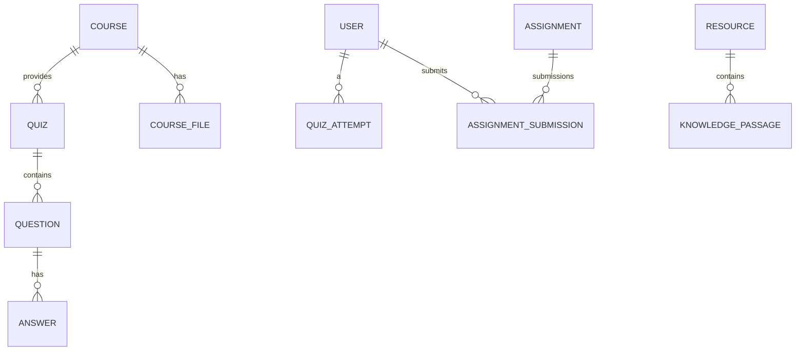
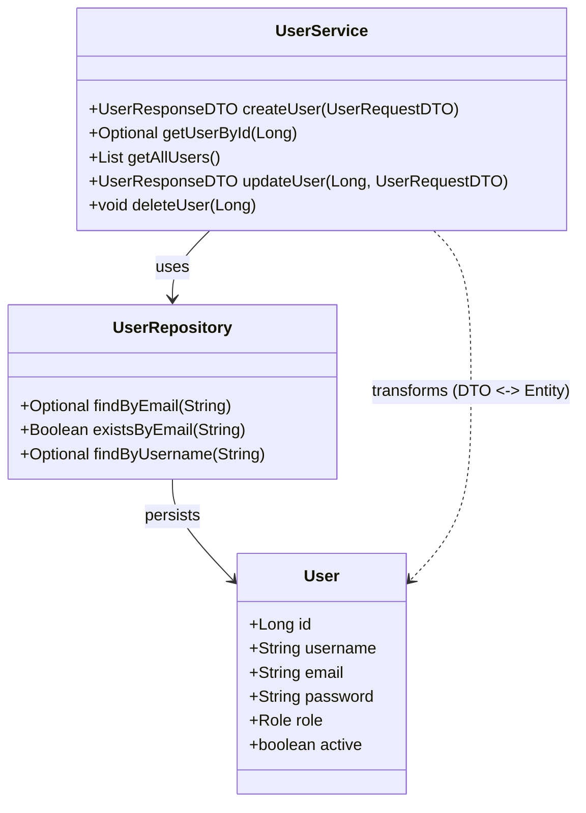

# Diagrammes — SmartHub (Mermaid explicite)

Tous les diagrammes ci-dessous utilisent des boîtes (rectangles) et des flèches pour montrer clairement les communications et relations entre composants.

## 1) Diagramme de composants global (rectangles & flèches)

```mermaid
flowchart LR
  subgraph CLIENT[Client / Frontend]
    A[Web / Mobile / API client]
  end

  subgraph API[API - Controllers]
    B[Controllers\n(e.g. UserController, QuizController)]
  end

  subgraph SERVICE[Service Layer]
    C[Services\n(e.g. UserService, QuizService, RAG services)]
    D[Agents\n(QuizOrchestratorAgent, RecommendationAgent)]
  end

  subgraph DATA[Data & External]
    E[Repositories\n(JPA Repositories)]
    F[(Database\nPostgreSQL / MariaDB)]
    G[File Storage\n(uploads/)]
    H[(Vector Store / KnowledgeBase)]
    I[AI Models\n(Gemini / Ollama)]
  end

  A -->|HTTP (JSON)| B
  B -->|appel service| C
  C -->|orchestration| D
  C -->|utilise| E
  E -->|CRUD| F
  C -->|stocke fichiers| G
  C -->|search / retrieve| H
  C -->|call model| I
  H -->|fournit passages| I
  D -->|met à jour| E
  A -->|upload files| G
```

Explication : Ce diagramme montre les boîtes claires pour chaque couche, les communications HTTP entre client et controllers, et les dépendances entre services, agents, repositories, base et services IA.

---

## 2) Séquence : création d'un utilisateur (flèches détaillées)



Notes : la flèche `Service->>Service` indique une opération interne (encodage). Toutes les validations métier (unicité) sont faites côté `Service`.

---

## 3) ERD (Entités principales avec relations, flèches)



Explication : Les relations OneToMany sont indiquées; les noms entre guillemets expliquent le sens.

---

## 4) Diagramme de classes (extrait simple, relations directionnelles)



Commentaire : le diagramme de classes ici est réduit pour lecture ; il montre les dépendances et transformations.

---

## 5) RAG flow (indexation → recherche → génération) — boîtes & flèches

```mermaid
flowchart LR
  Doc[Document (PDF / TXT)] -->|chunk| Chunker[Chunker / Splitter]
  Chunker -->|chucks| Normalizer[Cleaner / Normalizer]
  Normalizer -->|text| Embed[EmbeddingService]
  Embed -->|vectors| VectorStore[(Vector Store / KnowledgeBase)]

  UserQuery[Query / Topic] -->|embed| Embed
  Embed -->|query vector| VectorStore
  VectorStore -->|top-k passages| Retriever[RAG Retriever]
  Retriever -->|passages| PromptAssembler[Prompt Assembler]
  PromptAssembler -->|prompt| Model[AI Model (Gemini / Ollama)]
  Model -->|generated JSON / text| Parser[Parser]
  Parser -->|Quiz/Questions| Persistence[QuizService / Repos]
  Persistence -->|save meta| DB[(PostgreSQL + KB metadata)]
```

Explication : Ce schéma montre clairement l'ingestion, la génération d'embeddings, la recherche dans l'index puis la génération par le modèle IA.

---

## 6) Agents orchestration (flèches de communication)

```mermaid
flowchart TD
  subgraph Agents[Agents Layer]
    QA[QuizOrchestratorAgent]
    RA[RecommendationEngineAgent]
    PT[ProgressTrackerAgent]
  end

  User((User)) -->|startQuiz()| QA
  QA -->|requestRecommendations()| RA
  RA -->|return questions| QA
  QA -->|createSession()| QuizService[QuizService]
  QuizService -->|persistAttempt()| QuizAttemptRepo[QuizAttemptRepository]
  QuizAttemptRepo --> DB[(PostgreSQL)]
  QA -->|updateProfile(score)| PT
  PT -->|save profile| LearningProfileRepo[LearningProfileRepository]
```

Notes : Agents communiquent surtout avec services et repositories ; ils centralisent la logique asynchrone ou complexe.

---

## 7) Comment visualiser
- Copie les blocs `mermaid` dans un visualiseur Mermaid (ex: https://mermaid.live) ou utilise l'extension Mermaid de VSCode.

---

Fin du document `docs/diagrams.md`.