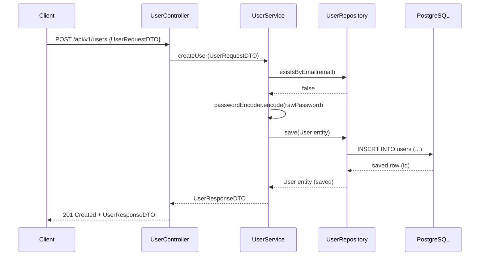
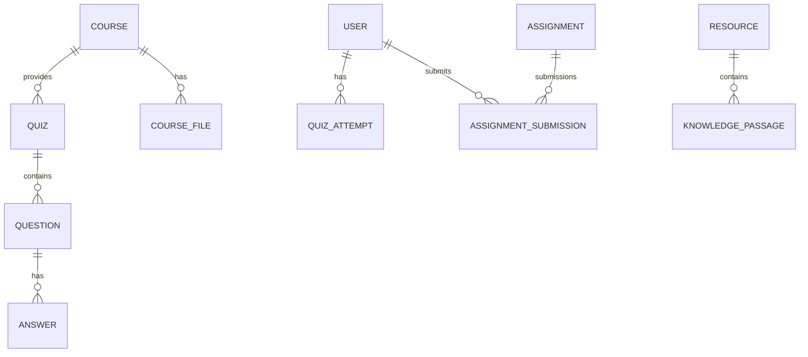
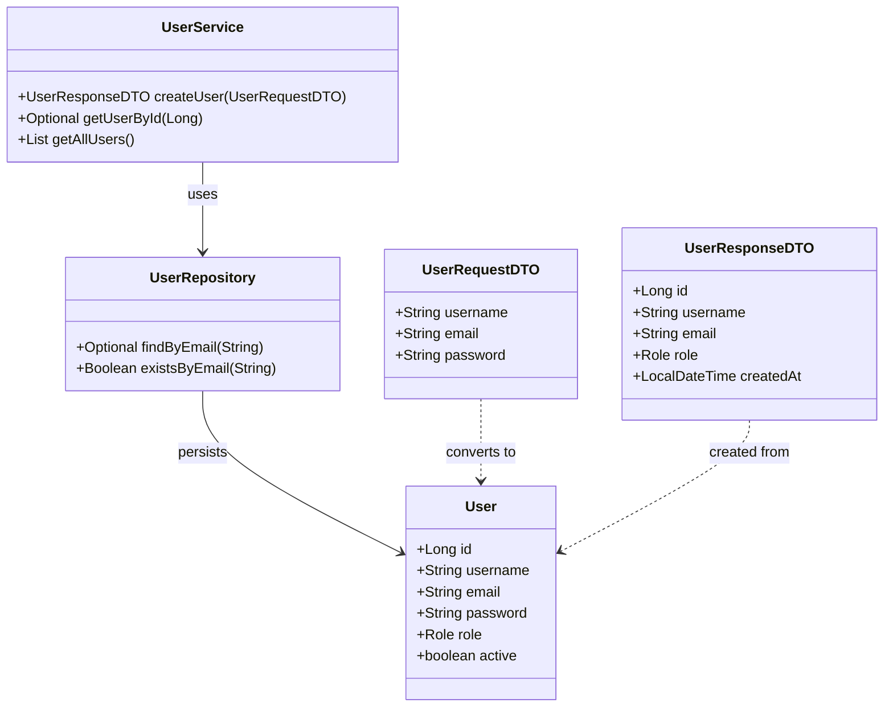
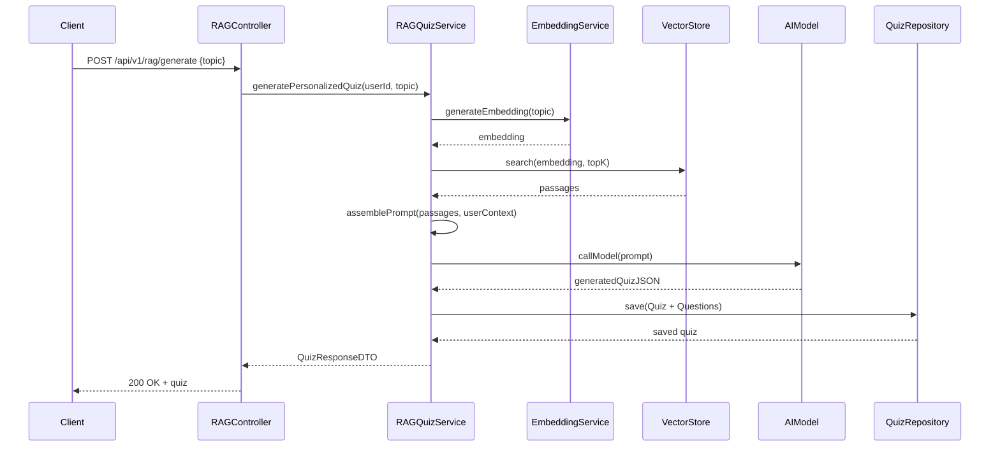

# Visualisation consolidée de l'architecture SmartHub (schémas explicites)

Ce document regroupe tous les schémas visuels (rectangles / boîtes) et explications pour comprendre l'architecture du backend SmartHub : couches, entités, DAO, agents et flux RAG. Les diagrammes ci-dessous utilisent des flèches et des libellés pour montrer clairement la communication et les relations.

> Ouvre ce fichier dans un visualiseur Mermaid (VSCode + extension Mermaid Live Preview ou https://mermaid.live) pour voir les schémas graphiques.

---

## 1) Architecture globale — composants et flèches

```mermaid
flowchart TB
  subgraph CLIENT[Client]
    A[Frontend (Web / Mobile) / API Consumer]
  end

  subgraph API[Controllers (API Layer)]
    B[UserController \n QuizController \n AuthController]
  end

  subgraph SERVICES[Service Layer]
    C[UserService \n QuizService \n RAG Services \n FileStorageService]
    D[Agents (Orchestrators) \n QuizOrchestratorAgent \n RecommendationEngineAgent]
  end

  subgraph DATA[Persistence & External]
    E[Repositories (JpaRepository)]
    F[(Database - PostgreSQL / MariaDB)]
    G[File Storage (uploads/)]
    H[(Vector Store / KnowledgeBase - Vector Index)]
    I[AI Models (Gemini / Ollama / External API)]
  end

  A -->|HTTP JSON| B
  B -->|appel métier| C
  C -->|orchestration / règles| D
  C -->|utilise CRUD| E
  E -->|SQL| F
  C -->|stocke fichiers| G
  C -->|index / recherche| H
  C -->|appel modèle| I
  H -->|passages| I
  D -->|met à jour profils / recommandations| E
```

Explication : Ce diagramme montre les composants principaux et la direction des appels. Les agents sont représentés comme des services d'orchestration qui peuvent appeler des services et repositories.

---

## 2) Flux détaillé Controller → Service → Repository (création utilisateur)



Explication : Toutes les validations métiers (unicité, règles) se font dans `Service`. Les controllers restent fins et exposent des DTOs.

---

## 3) ERD simplifié (entités principales + relations)



Explication : Le diagramme montre les cardinalités principales et le sens des relations.

---

## 4) Diagramme de classes (extrait : User / Service / Repository)



Explication : montre transformation DTO <-> Entity et dépendances.

---

## 5) Flux RAG complet (ingestion, indexation, recherche, génération)

```mermaid
flowchart LR
  subgraph Ingestion[Ingestion]
    Doc[Document (PDF/TXT/HTML)] -->|chunk| Chunker[Chunker / Splitter]
    Chunker --> Cleaner[Cleaner / Normalizer]
    Cleaner --> Embed[EmbeddingService]
    Embed --> VectorStore[(Vector Store / KB)]
  end

  subgraph Query[Query & Generation]
    UserQuery[User Query / Topic] -->|embed(query)| Embed
    Embed -->|query vector| VectorStore
    VectorStore -->|top-k passages| Retriever[RAG Retriever]
    Retriever -->|passages| Assembler[Prompt Assembler]
    Assembler -->|prompt| Model[AI Model (Gemini / Ollama)]
    Model -->|generated JSON/text| Parser[Parser]
    Parser -->|Quiz/Questions| Persistence[QuizService / Repos]
    Persistence -->|save metadata| DB[(PostgreSQL + KB metadata)]
  end

  VectorStore --- DB
```

Explication : Le flux montre ingestion + création d'embeddings, stockage dans un index vectoriel, puis recherche et génération via le modèle IA.

---

## 6) Agents & orchestration (boîtes & appels)

```mermaid
flowchart TD
  User((User)) -->|startQuiz(topic)| QA[QuizOrchestratorAgent]
  QA -->|requestRecommendations(user, topic)| RA[RecommendationEngineAgent]
  RA -->|return question list| QA
  QA -->|create session| QS[QuizService]
  QS -->|persist attempt| QAR[QuizAttemptRepository]
  QAR --> DB[(PostgreSQL)]
  QA -->|update learning profile| LPF[LearningProfileRepository]
```

Explication : Les agents coordonnent la sélection de questions, la création de sessions et la mise à jour des profils.

---

## 7) Use-case : génération RAG -> création de quiz (séquence)



Explication : montre toutes les étapes depuis la demande utilisateur jusqu'à la persistance du quiz généré.

---

## 8) Légende & conventions
- Rectangle / boîte = composant (classe, service, repository)
- Parenthèses = ressource externe (DB, vector-store)
- Flèches = direction d'appel (ex: HTTP, service call, DB CRUD)
- Les labels précisent l'action (ex: `save`, `search`, `callModel`)

---

Fin du document consolidé `docs/visual-architecture.md`.